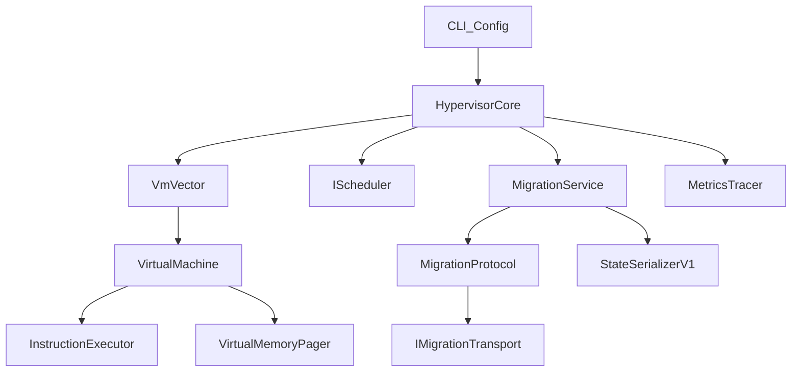

# Architecture

The showcase version separates the hypervisor into reusable C++ modules:

- `src/cpu`: instruction model and parser
- `src/memory`: paged virtual memory with page-table and TLB cache
- `src/vm`: `VirtualMachine` execution, faults, and snapshot state
- `src/scheduler`: pluggable `IScheduler` with round-robin, priority, and MLFQ policies
- `src/migration`: versioned state serialization, checksums, retries, and pre-copy style migration
- `src/hypervisor`: orchestration loop and VM lifecycle control
- `src/metrics`: scheduler and migration metrics

